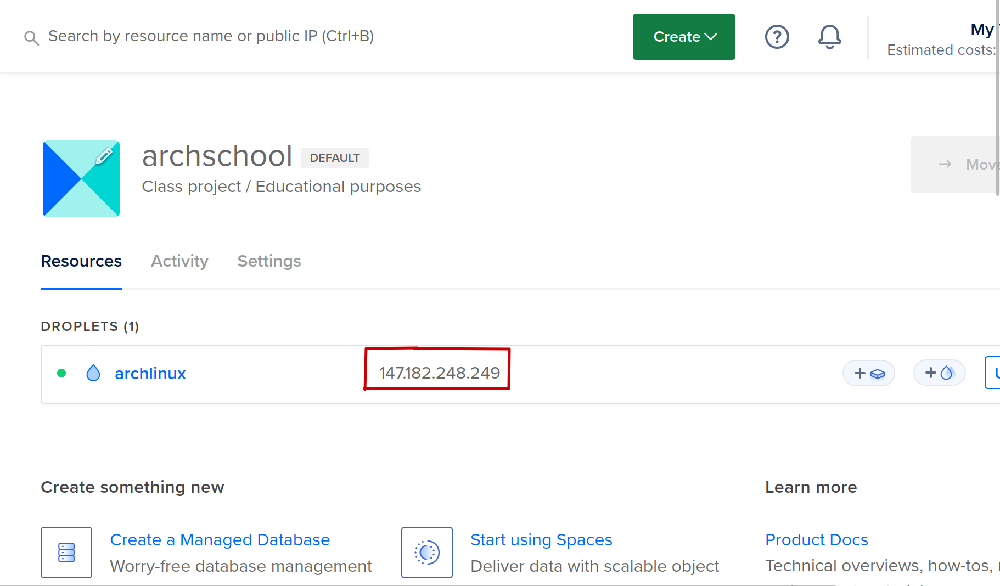
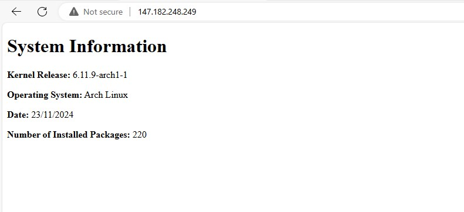

# Web Server setup script
This script creates a system user called "webgen", setup a preconfigured NGINX server that serves a html page containing your system info, and a firewall that allows http and ssh connections on your droplet.


## Prerequisites:
1. You MUST have updated your arch linux installation to the latest version by running
```bash
sudo pacman -Syu
```
and reload your droplet with
```bash
sudo systemctl reboot
```
once the droplet is online again, you can proceed with running this script

2. The ip address of the droplet that you would like to use to setup



## How to Run Script

Simply run the script with this command but subsitute with your ip address

```bash
sudo bash setup <your-ip-address-here>
```

Once the script has been executed, paste your ip into the address bar of your browser and you will see this page




Congratulations! you will now have a functioning webserver